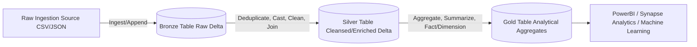

# Medallion Lakehouse Architecture Guide

The **Medallion Architecture** is a data design pattern introduced by Databricks that describes a logical structure for organizing data in a modern Lakehouse. Its main goal is to incrementally improve the structure and quality of data as it flows through three stages: **Bronze (Raw) ➡️ Silver (Cleansed/Enriched) ➡️ Gold (Curated Business Insights)**.

---

## 1. The Three Layers of Medallion

### 🟫 Bronze Layer (Raw Ingestion)
The Bronze layer is the landing zone where raw source files (JSON, CSV, Parquet, XML) are ingested. 
* **Design Guidelines**:
  * Store data in **Delta Lake** format.
  * Append-only. Do not update or delete records here.
  * Retain raw column names and nested structures. No schema modifications.
  * Add system metadata columns (e.g., `_ingestion_timestamp`, `_source_file_path`, `_adf_run_id`).
* **Objective**: Act as a historical archive of truth that can be re-queried or rebuilt at any point in the future.

### ⬜ Silver Layer (Cleansed & Enriched)
The Silver layer is the transformation zone where data is cleaned, validated, structured, and joined.
* **Design Guidelines**:
  * Apply schema validation and cast data types to correct formats.
  * Deduplicate records based on business keys (using primary IDs and timestamp watermarks).
  * Filter out corrupted or invalid rows (anomalies).
  * Standardize columns (e.g., lowercase names, standard date formats `YYYY-MM-DD`, standard country codes).
  * Join separate Bronze tables into enriched datasets (e.g., joining sales transactions with customer profiles).
* **Objective**: Provide a reliable, cleansed, and queryable view of the operational enterprise data.

### 🟨 Gold Layer (Curated Analytical Data)
The Gold layer contains the aggregated data ready for consumption by business analysts, report builders, and data scientists.
* **Design Guidelines**:
  * Aggregated and grouped calculations (e.g., daily revenue, active monthly users).
  * Implemented as star schemas (Fact and Dimension tables) or denormalized wide-reporting tables.
  * High-performance structures optimized for BI reporting tools like PowerBI.
* **Objective**: Provide reliable business metrics and fast analytical performance.

---

## 2. Delta Lake: The Foundation of Medallion

Delta Lake is an open-source storage layer that runs on top of cloud object store formats (like Parquet). It provides the critical capability to run Medallion architectures reliably:

1. **ACID Transactions**: Ensures data integrity by ensuring that multiple readers/writers do not corrupt datasets during simultaneous updates.
2. **Schema Enforcement & Evolution**: Prevents corrupted schemas from entering Silver/Gold layers (enforcement) while allowing controlled updates when source schemas change (evolution).
3. **Time Travel**: Allows querying historical snapshots of your data using Delta Lake transaction logs.
4. **Unified Batch and Streaming**: Enables streaming raw data into Bronze while batch transforming it into Silver and Gold tables.
