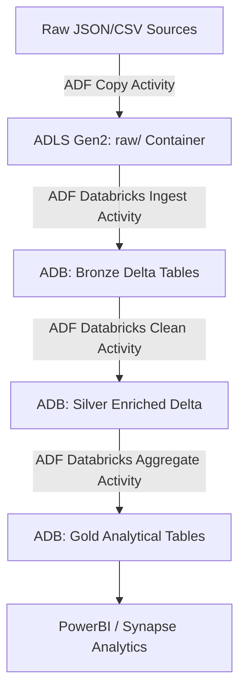

# Azure Deployment Guide: Medallion ETL Pipelines (ADF, ADB, ADLS Gen2)

This guide details the step-by-step process of deploying the E-Commerce and IoT Telemetry Medallion pipelines to Microsoft Azure.



---

## 1. Resource Provisioning on Azure

Log in to the [Azure Portal](https://portal.azure.com/) and create the following services in a single **Resource Group**:

1. **Azure Data Lake Storage Gen2 (ADLS Gen2)**:
   * Create a standard Storage Account.
   * **Crucial**: Under the "Advanced" tab, enable **Hierarchical Namespace** (this converts standard blob storage to ADLS Gen2).
2. **Azure Databricks (ADB)**:
   * Create a Azure Databricks Service (Trial or Premium tier).
3. **Azure Data Factory (ADF)**:
   * Create a standard Data Factory V2 instance.

---

## 2. Step 1: Storage Account Configuration (ADLS Gen2)

1. Open your Storage Account in the Azure Portal.
2. Go to **Containers** under Data Storage.
3. Create four containers representing the Medallion zones:
   * `landing` or `raw` (for copy source landing)
   * `bronze`
   * `silver`
   * `gold`

---

## 3. Step 2: Databricks Deployment & Notebook Setup

### A. Link GitHub to Databricks
1. Open your **Azure Databricks Workspace**.
2. Go to **User Settings** (bottom-left) ➡️ **Git Integration**.
3. Select GitHub and authenticate using a Personal Access Token (PAT).
4. Go to **Workspace** ➡️ **Repos** ➡️ **Add Repo**.
5. Paste your GitHub repository URL: `https://github.com/gatlakiran02/Azure-Data-Engineering.git`.
   * This imports all scripts directly into your Databricks environment.

### B. Configure ADLS Gen2 Access in Databricks
To read and write Delta tables on ADLS Gen2, Databricks needs authentication. There are two standard approaches:

#### Approach 1: Mount ADLS Gen2 containers (Easiest for learning)
Create a helper notebook in Databricks and run the following command to mount the containers to DBFS using an SAS token or Access Key:

```python
dbutils.fs.mount(
  source = "wasbs://bronze@YOUR_STORAGE_ACCOUNT.blob.core.windows.net",
  mount_point = "/mnt/bronze",
  extra_configs = {"fs.azure.account.key.YOUR_STORAGE_ACCOUNT.blob.core.windows.net":"YOUR_ACCESS_KEY"}
)
```

#### Approach 2: Direct ABFSS paths using Service Principal (Production standard)
Set the credential provider in your cluster configuration or inside the SparkSession configuration:

```python
spark.conf.set("fs.azure.account.auth.type.YOUR_STORAGE_ACCOUNT.dfs.core.windows.net", "OAuth")
spark.conf.set("fs.azure.account.oauth.provider.type.YOUR_STORAGE_ACCOUNT.dfs.core.windows.net", "org.apache.hadoop.fs.azurebfs.oauth2.ClientCredsTokenProvider")
spark.conf.set("fs.azure.account.oauth2.client.id.YOUR_STORAGE_ACCOUNT.dfs.core.windows.net", "YOUR_CLIENT_ID")
spark.conf.set("fs.azure.account.oauth2.client.secret.YOUR_STORAGE_ACCOUNT.dfs.core.windows.net", "YOUR_CLIENT_SECRET")
spark.conf.set("fs.azure.account.oauth2.client.endpoint.YOUR_STORAGE_ACCOUNT.dfs.core.windows.net", "https://login.microsoftonline.com/YOUR_TENANT_ID/oauth2/token")
```

### C. Modify Notebook Paths to ADLS Gen2
In the project scripts (`bronze.py`, `silver.py`, `gold.py`), change local folders (like `data/project1/...`) to use ADLS Gen2 paths:
* If using mounts: `dbfs:/mnt/bronze/project1/`
* If using direct access: `abfss://bronze@YOUR_STORAGE_ACCOUNT.dfs.core.windows.net/project1/`

---

## 4. Step 3: Azure Data Factory (ADF) Orchestration

### A. Setup Linked Services
In ADF studio, go to the **Manage** tab ➡️ **Linked Services**:
1. **ADLS Gen2 Linked Service**: Points to your Storage Account.
2. **Azure Databricks Linked Service**: Choose your Databricks workspace and authenticate using an Access Token generated in Databricks (Settings ➡️ Developer ➡️ Access Tokens).

### B. Create datasets
1. **Raw Source Dataset**: Pointing to where your raw files enter (e.g., REST API, SFTP, local file system, or a Blob landing container).
2. **ADLS Gen2 Raw Sink Dataset**: Pointing to the `raw` container in ADLS Gen2.

### C. Create ADF Pipeline (Orchestration Flow)
1. Add a **Copy Data Activity**:
   * **Source**: Your Raw Source Dataset.
   * **Sink**: ADLS Gen2 Raw Sink Dataset.
   * *This copies the files from source into the `raw/` folder in ADLS.*
2. Drag and drop three **Databricks Notebook Activities** to run sequentially:
   * **Activity 1 (Bronze Ingestion)**: Points to `06_Project1_Ecommerce_ETL/bronze.py` notebook.
   * **Activity 2 (Silver Cleansing)**: Points to `06_Project1_Ecommerce_ETL/silver.py` notebook. Connect a success constraint (`green arrow`) from Bronze.
   * **Activity 3 (Gold Aggregates)**: Points to `06_Project1_Ecommerce_ETL/gold.py` notebook. Connect a success constraint from Silver.

```
+--------------------+      +-----------------------+      +-----------------------+      +---------------------+
| Copy Raw file to   | ===> | Run Bronze Notebook   | ===> | Run Silver Notebook   | ===> | Run Gold Notebook   |
| ADLS Gen2 Landing  |      | Ingest to Delta       |      | Clean & Enrich        |      | Business Metrics    |
+--------------------+      +-----------------------+      +-----------------------+      +---------------------+
```

### D. Setup Pipeline Triggers
* **Schedule Trigger**: Trigger pipeline execution hourly, daily, or weekly.
* **Tumbling Window Trigger**: For processing historical backfills.
* **Storage Event Trigger**: Instantly trigger the pipeline the moment a new CSV or JSON file is uploaded to the raw landing zone.
